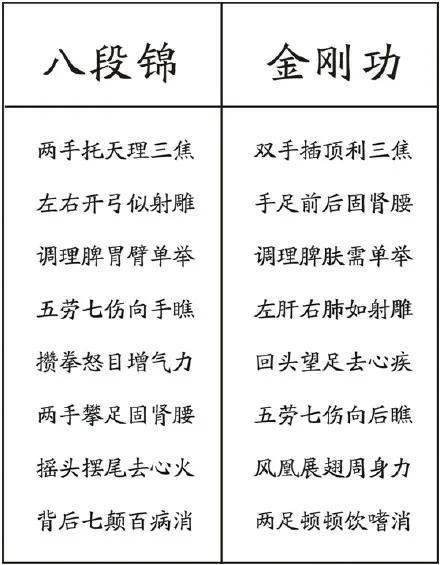
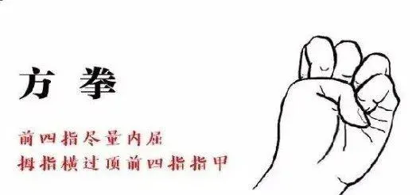

# 八部金刚功

## 简介

八部金刚功应用“天人合一”的自然规律，结合“阴阳五行”的中医理论，通过八套动作运用刚性内劲之气来疏通全身的经脉，使身躯、骨骼、关节的连接畅通，调整脊椎骨的某些变形与错位，使其神经系统恢复正常；同时协调五脏六腑的运作，排除体内各种病气，从而达到阴阳平衡、祛病健身、延年益寿的目的。实为养生长寿之上乘功法。本功法不分男女皆可习练。

八部金刚功学习讲解：*https://search.bilibili.com/all?keyword=%E5%85%AB%E9%83%A8%E9%87%91%E5%88%9A%E5%8A%9F&from_source=webtop_search&spm_id_from=333.1007&search_source=5*

**预备式**

**第一部  双手插顶利三焦**

**第二部  手足前后固肾腰**

**第三部  调理脾肤需单举**

**第四部  左肝右肺如射雕**

**第五部  回头望足去心疾**

**第六部  五劳七伤向后瞧**

**第七部  凤凰展翅周身力**

**第八部  两足顿顿饮嗜消**

**收功式**

道爷慈悲，功德无量，造福广大众生，把两部功法都无私的传播给了众人，一套八部金刚功，一套八部长寿功，这都是道家秘传不外传的功法，我们有缘得见，断断续续练习了一段时间。目前练习这套功法的人越来越多，并且受益者日众，特整理一篇简要介绍，供大家学习，让更多人受益，以此缅怀道爷。

金刚功历史悠久。据师传，早在唐代已有雏形。到宋代，许多宫观已在推广。经元、明至清代早期，已普及到民间，有的历名为《八段锦》。随着各门派、各人之修炼、心法与动作有所变化。我们现传的金刚功，是按内部师承称八部金刚功（又称外八部），在心法、顺序、招式动作上，与八段锦都有很大的不同。现抄录比较如下：

八部金刚功为道家南五祖张紫阳创立，本为道家秘不外传之法。张至顺道长为怜悯苍生多灾多难特将功法公之于众，看似简单的几个步骤，但暗合妙道，有不可思议之处。经证实确能使诸多癌症等重疾妙手回春，今特地转发此文，以结有缘参考。
张至顺道长，中国道教全真龙门正宗第二十一代传人，著有《炁体源流》《金刚长寿功》《济世良方》，2015年104岁羽化湖南黄中宫。

金刚功功法的排列顺序，深含妙理。首先从通“利三焦”、发动全身的气机开始。然后，逐个脏腑锻炼。以哪一脏腑为先呢?《黄帝内经》说：“肾为心之主，脾为肾之主，肝为脾之主，肺为肝之主，心为肺之主。”按照《黄帝内经》的原理，先固肾腰。“肾为先天之本”，他是人的生命的根基。其顺用于外，可以生人；其逆用于己，可以自生。根深叶茂，欲枝叶繁茂，必须先培根本。脾为后天之本，故“固肾腰”之后，接之以“调理脾肤”(肤指皮肤与肌肉之间的隔膜细胞组织)。继而，是“左肝右肺”。然后，对最主要的“君主之官”的心脏，用“回头望足去心疾”来调理。

这个顺序正是《黄帝内经》五脏所示的顺序，有炼了一脏、巩固一脏之功用。在此基础上，还要对一些潜伏的“五劳七伤“身疾，以“神光向后瞧”来扫除它。这样，就可以祛病健身，为使身体更加强壮，又通过“凤凰展翅周身力”和两足消顿顿饮嗜消”的功法锻炼，使全身经络血脉畅通，消除饮食阻滞与不良嗜好，预防各种疾病，从而，达到圆满之功效。

## 金刚功动作练习要点

《金刚功》是外八部，外八部金刚，可以祛病、健身。处处都要用力。

一：起势，双手插顶利三焦。三焦分别是人体以胸、肚脐为分界点分上中下三段。从外用直立、用刚立，八个大动脉（阴跷脉、阳跷脉、冲脉、带脉、任脉、督脉、阳维脉、阴维脉）总结起来，把气提起来，归拢到中焦直行为脉，横行为络，内通五脏，往外三百六十五骨节，八万四千毫毛。阴阳气一冲一合，往上举到劲慢慢地走， 往上冲要用力，往下合要压。 

二：手足前后固肾腰。每个动作要用力，慢慢走。 

三：调理脾肤需单举。调理脾脏有两个大络在两肋，脾就是脾里肤外，药物治疗不到。向上猛举，向下猛按，用力—翻掌—攥拳—合拢，用力往上举，像举千斤重，用力往下按，就像按只猛兽。翻掌要猛，攥拳合拢也要用力。一举一动都要用力。 

四：左肝右肺如射雕。用力转 2 圈，提上来，攥拳。左：左腿弓右腿蹬；右：右腿弓左腿蹬，用力拉线用劲。 

五：回头望足去心疾。左：左手往下往后扠（右脚），左脚弓，右手往前推，右脚蹬，身形一致，两手一致，就像一条直线。心思要稳定， 

六：五劳七伤向后瞧。慢慢转身，两手交叉往下按拢。慢慢向后转看到脚跟，再慢慢转到正面稍停，然后再转。脚要把稳不要动，调整带脉，带在胸下、脐上，联系七个大脉络，随自己几遍，最少 5 遍，运功每个动作要慢。五劳七伤：五 劳（久行伤筋、久立伤骨、久坐伤血、久睡伤脉、久思伤神），七情之伤（喜怒忧思悲恐惊），六欲（风寒暑湿燥火外感）。

七：凤凰展翅周身力。转三圈，手转圈，眼随手，点头，凤凰三点头，不要急，点到脚背，两手是个直线。转动的时候要用力，也要快。全身上的筋骨气血都会转动，五脏（心肝脾肺肾）六腑（大肠、小肠、膀胱、胆、三焦、命门）。上阳之光练习最好。

八：两足顿顿饭嗜消。两臂靠紧，牙叩住，脚尖持地，脚跟往上提。往上一提，冲脉往上，督脉往上提，任脉往下降。2 大 3 小。脚心是涌泉穴，肾脏的海底。

收功：从下往上到口鼻分开，慢慢慢慢往下降。

## 八部金刚功注意事项

1．金刚功中握的拳为方拳，大拇指盖住四指的指甲，如图：

2．练习金刚功之前必须做充分的准备活动，如活动膝盖、腰、手腕脚腕，抻筋、压腿等。练功时要循序渐进，量力而行，避免扭伤。涉及下蹲的动作膝盖不要超过脚尖。

3．饭后一小时内不能练，最好两小时后再练。下雨、大风、大雾、打雷或天气恶劣时不要在室外练习。

4．每部最少做5遍，最多不超过9遍。对称的动作不能只练一边，练完左右对称动作算一遍。

5．练功前要全身放松、排除杂念、心志专一、意守本体、安静自然。练习时要自然呼吸，千万不要关注或配合呼吸；千万不要关注体感、气感等，有气感很正常，但不能执着，要无视这些。从心理上不要把它当功法练，而是当广播体操练，这样动作更自然，心思简单，效果反而更好。

6．金刚功宜在早上太阳出、未出时面对东方练习；长寿功宜在晚上静时面对月亮练。若受生活和工作的限制，也不强求。要注意每套功都要从预备式起，练完后一定要收功。

7．从力度上讲，金刚功讲究内力、暗力。也就是说整个用力过程，要有连绵不断的平等力和持续性。而不是外力、强力、僵力。用自身7-8成力，不要用全力，主要手用力。

8．初学时，动作不要求规范标准，一般的照动作做，不出大体就行。随着体力和练功动作的熟练，逐步的达到标准化、规范化。切忌操之过急。

9．可根据自己的病情和兴趣，选练其中一部或几部，或选择动作容易的先练，但每次一定要做起式，练完一定要收功。当然，练完全套功更好。

10．女性生理期、怀孕期间禁止练习。这里解释一下，金刚功走血快，凡是身体上出现了出血症状都不要练，同时女性生理期是独有的排毒阶段，练功会影响自身排毒，而且生理期休息不会前功尽弃，生理期彻底结束后继续练习即可。

11．病情严重或残疾不能站立，可坐着练，躺着练。不能动手可以动脚，不能动脚可以动手。周身活动不畅通者，可以练金刚功的第六部或长寿功的第一或第二或第八部均可。

12．练功后如出现呕吐杂质、吐血、尿血、便血、泄泻、汗出如胶等现象时，精神正常或精力更加充沛，则属正常。如精神萎靡不振或疲惫乏力则要停练。检查动作是否符合要求，近日饮食起居是否失节。

13．习练金刚功多见下面几种现象：

<ul style="margin-left: 20px;list-style: none;">
<li>（1）嗜睡，这是因为精气神不够，练功后人体自我调节出现的现象，一般持续一到两周时间，因体质差异和练功勤快与否有差别。</li>
<li>（2）拉肚子，不同于生病拉肚子，排泄物粘粘糊糊带黑色或暗灰色；虽然拉肚子，但精神很好，持续时间不长。</li>
<li>（3）病情加重，感到病灶部位疼痛加剧，这是治病除根的关键时候，要继续练功攻克它不要怕，经过一段时间病症会减轻而至痊愈。</li>
</ul>

14．金刚功推广之后的效果（张道长和许道长的总结）：

对头痛、失眠、健忘、过度肥胖、高血压、心脏病、脑血管硬化、胆结石、尿结石、肝炎、肺炎、哮喘、脾胃病、肩周炎、脊椎病、各种眼疾及肿瘤、某些癌症等均有很好的辅助治疗效果。青岛一癌患者练金刚功，累了就歇，歇了又练，一天练到晚，每部不超9遍，一天练多次，一个月后胃癌竟然消失。总之，金刚功对祛病健身的效果是非常好的。 

